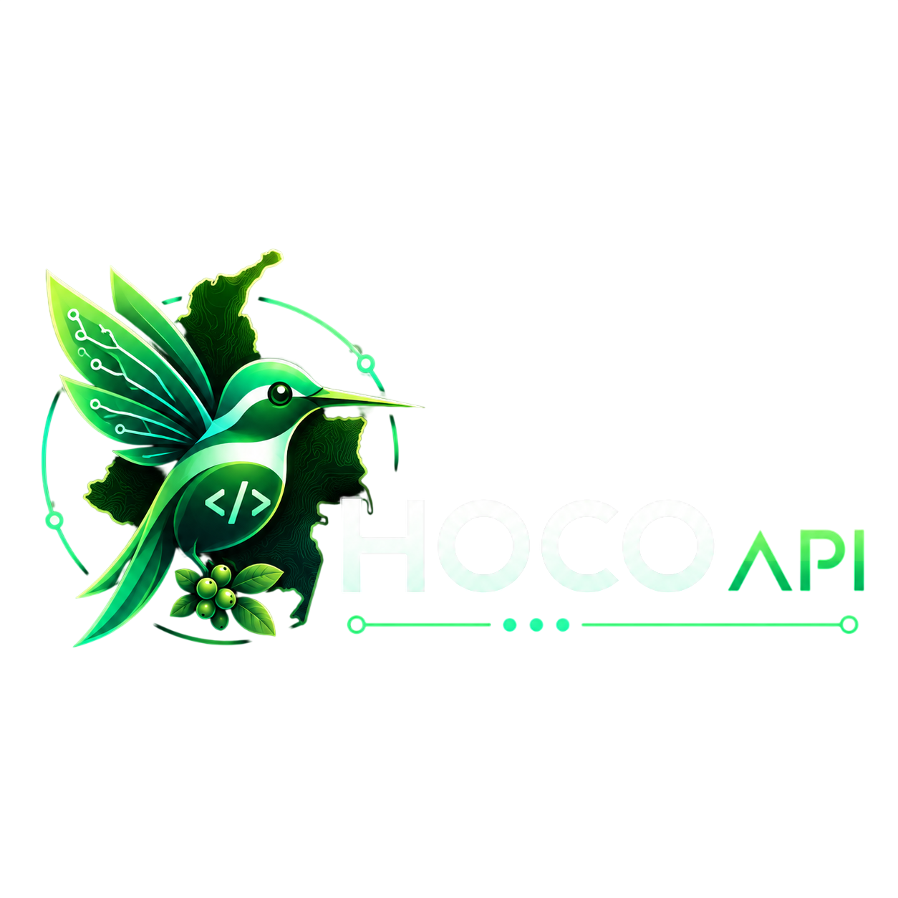

# HOCO API

<p align="center">
  
</p>

<p align="center">
  <strong>Festivos y dias habiles de Colombia en una API simple, rapida y publica.</strong>
</p>

<p align="center">
  <a href="https://api.hocoapi-colombia.workers.dev">
    
  </a>
  <a href="https://api.hocoapi-colombia.workers.dev/api/docs">
    
  </a>
  
  
</p>


---

## Tabla de contenido

| | | |
| --- | --- | --- |
| 1. [Descripcion](#descripcion) | 7. [Formato de respuesta](#formato-de-respuesta) | 13. [Despliegue](#despliegue) |
| 2. [URL publica](#url-publica) | 8. [Como calcula los festivos de Colombia](#como-calcula-los-festivos-de-colombia) | 14. [Estructura del proyecto](#estructura-del-proyecto) |
| 3. [Caracteristicas](#caracteristicas) | 9. [Calculo de dias habiles](#calculo-de-dias-habiles) | 15. [Casos de uso](#casos-de-uso) |
| 4. [Tecnologias](#tecnologias) | 10. [Validaciones](#validaciones) | 16. [Roadmap](#roadmap) |
| 5. [Endpoints](#endpoints) | 11. [Instalacion local](#instalacion-local) | 17. [Autor](#autor) |
| 6. [Ejemplos rapidos](#ejemplos-rapidos) | 12. [Scripts disponibles](#scripts-disponibles) | 18. [Licencia](#licencia) |

---

## Descripcion

**HOCO API** es una API publica para consultar festivos nacionales de Colombia, validar si una fecha es festiva y calcular dias habiles excluyendo sabados, domingos y festivos.

El nombre viene de:

```txt
HO = Holiday
CO = Colombia
```

La API esta pensada para proyectos que necesitan trabajar con fechas laborales reales en Colombia, como sistemas de reservas, nomina, calendarios empresariales, operaciones logisticas, agendas, dashboards administrativos o automatizaciones internas.

## URL publica

| Recurso | URL |
| --- | --- |
| API | https://api.hocoapi-colombia.workers.dev |
| Swagger | https://api.hocoapi-colombia.workers.dev/api/docs |
| OpenAPI JSON | https://api.hocoapi-colombia.workers.dev/api/openapi.json |

## Caracteristicas

- Consulta festivos nacionales de Colombia por ano.
- Valida si una fecha especifica es festiva.
- Calcula dias habiles entre dos fechas.
- Excluye sabados, domingos y festivos nacionales.
- Calcula festivos fijos, trasladables y basados en Semana Santa.
- No depende de servicios externos para calcular los festivos.
- Incluye documentacion Swagger.
- Expone especificacion OpenAPI en JSON.
- Desplegada en Cloudflare Workers para alta disponibilidad.

## Tecnologias

| Tecnologia | Uso |
| --- | --- |
| Hono | Framework HTTP ligero para APIs modernas |
| TypeScript | Tipado estatico y mejor mantenibilidad |
| Cloudflare Workers | Runtime serverless global |
| Wrangler | CLI para desarrollo y despliegue en Cloudflare |
| OpenAPI | Especificacion formal de la API |
| Swagger UI | Documentacion interactiva |

## Endpoints

| Metodo | Endpoint | Descripcion |
| --- | --- | --- |
| GET | /api/health | Consulta el estado de la API |
| GET | /api/holiday/:year | Consulta los festivos de Colombia por ano |
| GET | /api/holiday/check/:date | Valida si una fecha es festiva |
| GET | /api/business-days?from=YYYY-MM-DD&to=YYYY-MM-DD | Calcula dias habiles entre dos fechas |

## Ejemplos rapidos

### Estado de la API

```http
GET /api/health
```

https://api.hocoapi-colombia.workers.dev/api/health

### Consultar festivos por ano

```http
GET /api/holiday/2026
```

https://api.hocoapi-colombia.workers.dev/api/holiday/2026

### Validar una fecha

```http
GET /api/holiday/check/2026-07-20
```

https://api.hocoapi-colombia.workers.dev/api/holiday/check/2026-07-20

### Calcular dias habiles

```http
GET /api/business-days?from=2026-01-01&to=2026-06-01
```

https://api.hocoapi-colombia.workers.dev/api/business-days?from=2026-01-01&to=2026-06-01

## Formato de respuesta

Todas las respuestas siguen una estructura estandar para que sea facil consumir la API desde cualquier frontend, backend o automatizacion.

Respuesta exitosa:

```json
{
  "success": true,
  "message": "Operacion realizada correctamente.",
  "data": {}
}
```

Respuesta con error:

```json
{
  "success": false,
  "message": "Descripcion del error.",
  "error": {
    "statusCode": 400,
    "details": {}
  }
}
```

Ejemplo de respuesta: festivos por ano

```json
{
  "success": true,
  "message": "Festivos consultados correctamente.",
  "data": {
    "pais": "Colombia",
    "anio": 2026,
    "total": 18,
    "festivos": [
      {
        "nombre": "Ano Nuevo",
        "fecha": "2026-01-01",
        "tipo": "FIXED",
        "trasladado": false
      },
      {
        "nombre": "Dia de los Reyes Magos",
        "fecha": "2026-01-12",
        "tipo": "MOVED_TO_MONDAY",
        "trasladado": true,
        "fechaOriginal": "2026-01-06"
      }
    ]
  }
}
```

Ejemplo de respuesta: dias habiles

```json
{
  "success": true,
  "message": "Dias habiles calculados correctamente.",
  "data": {
    "from": "2026-01-01",
    "to": "2026-06-01",
    "businessDays": 101,
    "calendarDays": 152,
    "holidaysInRange": [
      "2026-01-01",
      "2026-01-12",
      "2026-03-23",
      "2026-04-02",
      "2026-04-03",
      "2026-05-01",
      "2026-05-18"
    ]
  }
}
```

## Como calcula los festivos de Colombia

HOCO API calcula los festivos internamente, sin depender de servicios externos.

La logica contempla tres tipos principales de festivos:

### 1. Festivos fijos

Son fechas que siempre ocurren el mismo dia y mes.

| Festivo | Fecha |
| --- | --- |
| Ano Nuevo | 1 de enero |
| Dia del Trabajo | 1 de mayo |
| Independencia de Colombia | 20 de julio |
| Batalla de Boyaca | 7 de agosto |
| Inmaculada Concepcion | 8 de diciembre |
| Navidad | 25 de diciembre |

### 2. Festivos trasladados al lunes

Algunos festivos en Colombia se trasladan al siguiente lunes cuando no caen lunes.

| Festivo | Fecha base |
| --- | --- |
| Dia de los Reyes Magos | 6 de enero |
| Dia de San Jose | 19 de marzo |
| San Pedro y San Pablo | 29 de junio |
| Asuncion de la Virgen | 15 de agosto |
| Dia de la Raza | 12 de octubre |
| Todos los Santos | 1 de noviembre |
| Independencia de Cartagena | 11 de noviembre |

### 3. Festivos basados en Semana Santa

La API calcula primero el Domingo de Pascua para el ano consultado.
A partir de esa fecha obtiene los festivos relacionados con Semana Santa.

| Festivo | Calculo |
| --- | --- |
| Jueves Santo | Pascua - 3 dias |
| Viernes Santo | Pascua - 2 dias |
| Ascension del Senor | Relativo a Pascua y trasladado al lunes |
| Cuerpo de Cristo | Relativo a Pascua y trasladado al lunes |
| Sagrado Corazon de Jesus | Relativo a Pascua y trasladado al lunes |

## Calculo de dias habiles

Para calcular dias habiles, HOCO API:

1. Recorre cada dia entre `from` y `to`.
2. Excluye sabados.
3. Excluye domingos.
4. Excluye festivos nacionales de Colombia.
5. Retorna dias calendario, dias habiles y festivos encontrados dentro del rango.

## Validaciones

| Parametro | Regla |
| --- | --- |
| year | Debe ser un ano valido entre 1900 y 2100 |
| date | Debe tener formato YYYY-MM-DD |
| from | Debe tener formato YYYY-MM-DD |
| to | Debe tener formato YYYY-MM-DD |
| range | from no puede ser mayor que to |

## Instalacion local

1. Clonar el repositorio:

```bash
git clone https://github.com/Jhormanrios0/holidaysAPI.git
```

2. Entrar al proyecto:

```bash
cd holidaysAPI
```

3. Instalar dependencias:

```bash
npm install
```

4. Ejecutar localmente:

```bash
npm run dev
```

La API quedara disponible en:

http://localhost:8787

La documentacion local quedara disponible en:

http://localhost:8787/api/docs

## Scripts disponibles

| Script | Descripcion |
| --- | --- |
| npm run dev | Ejecuta la API localmente con Wrangler |
| npm run build | Valida TypeScript |
| npm run deploy | Despliega en Cloudflare Workers |

## Despliegue

Validar proyecto:

```bash
npm run build
```

Desplegar en Cloudflare Workers:

```bash
npm run deploy
```

## Estructura del proyecto

```txt
src/
|- docs/
|  |- docs.routes.ts
|  `- openapi.ts
|- holidays/
|  |- holidays.routes.ts
|  |- holidays.service.ts
|  `- holidays.types.ts
|- lib/
|  |- response.ts
|  `- validators.ts
`- index.ts
```

## Casos de uso

HOCO API puede ser util para:

- Calendarios laborales.
- Plataformas de reservas.
- Calculo de fechas limite.
- Sistemas de nomina.
- Gestion de turnos.
- Planificacion logistica.
- Dashboards administrativos.
- Automatizaciones internas.
- Validacion de fechas en formularios.

## Roadmap

Algunas mejoras futuras posibles:

- Soporte para mas paises de Latinoamerica.
- Endpoint para proximos festivos.
- Endpoint para festivos por rango.
- Filtros por tipo de festivo.
- SDK para JavaScript/TypeScript.
- Dashboard de uso.
- Cache avanzado por ano.

## Autor

Desarrollado por Jhorman Rios.

GitHub:

https://github.com/Jhormanrios0

Repositorio:

https://github.com/Jhormanrios0/holidaysAPI

## Licencia

Este proyecto esta publicado bajo la licencia MIT.

Puedes usarlo, modificarlo y distribuirlo libremente, manteniendo el aviso de copyright y la licencia original.

```txt
MIT License

Copyright (c) 2026 Jhorman Rios
```

<p align="center">Hecho con enfoque en Colombia, simplicidad y buen desarrollo.</p>
